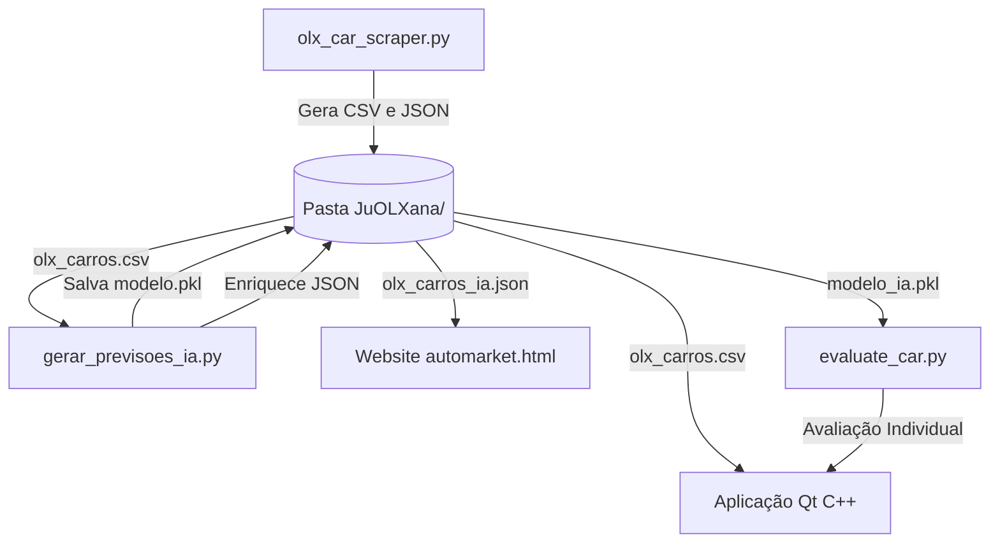

# Plataforma de Análise de Valor no Mercado Automóvel 🚗🤖

Este projeto é um ecossistema integrado para recolha, análise analítica e monitorização de preços de automóveis usados no mercado português (OLX Portugal). O sistema combina um motor de Inteligência Artificial para avaliação de valor justo de mercado, um portal web de pesquisa, uma aplicação desktop Qt (C++) interativa e workflows de automação n8n.

---

## 🏛️ Arquitetura Geral & Partilha de Dados

O sistema está estruturado de forma a partilhar dados em tempo real entre a aplicação desktop e o website através de um diretório de dados unificado na pasta `/JuOLXana`:



1. **Ficheiro de Dados Único (`olx_carros.csv`):** Tanto o scraper da app Qt como o script unificador do site escrevem e lêem a partir de `JuOLXana/olx_carros.csv`. Isto garante que qualquer dados extraídos por um lado estão imediatamente disponíveis para o outro.
2. **Previsões de IA (`olx_carros_ia.json`):** A inteligência analítica treina os modelos com base no CSV unificado e enriquece os anúncios no JSON final consumido pelo website, calculando os desvios e oportunidades de mercado.
3. **Persistência de Modelos (`modelo_ia.pkl`):** O modelo vencedor (XGBoost/LightGBM com $R^2 \approx 0.91$) é serializado e guardado em `JuOLXana/modelo_ia.pkl`. O painel de avaliação da app Qt utiliza o script `evaluate_car.py` para carregar este ficheiro e prever o valor justo instantaneamente, sem necessidade de re-treino.

---

## 🚀 Como Executar o Projeto

### 📦 Instalação de Dependências Python

O ambiente requer Python 3.8+ com as seguintes bibliotecas:
```bash
pip install pandas numpy scikit-learn xgboost lightgbm beautifulsoup4 selenium undetected-chromedriver matplotlib tqdm
```

---

### 🖥️ 1. Aplicação Desktop Qt (C++) — `GeOLXavani`

A aplicação C++ é constituída por três painéis funcionais:
- **Webscraping Panel:** Corre o scraper de forma parametrizável (marca, páginas, limites de preço e ano).
- **ML Training Console:** Treina os 6 modelos de regressão interativamente em tempo real e visualiza gráficos de desempenho.
- **Check & Evaluate Cars:** Permite pesquisar localmente no dataset e efetuar avaliações instantâneas de mercado para veículos personalizados.

#### Compilação e Execução:
Certifique-se de que tem o CMake e as bibliotecas Qt6 (Widgets) instaladas.
```bash
cd GeOLXavani
mkdir build && cd build
cmake ..
cmake --build .
# Para executar no Windows:
./appGeOLXavani.exe
```

---

### 🌐 2. Portal Web & Automatização — `JuOLXana`

O portal AutoMercado disponibiliza uma interface interativa (SPA) com filtros avançados e ordenação dinâmica por "Melhor Negócio" (desvio face à estimativa da IA).

#### Execução do Site:
1. Simplesmente abra o ficheiro [automarket.html](file:///c:/Users/geova/OneDrive/Documentos/GitHub/An-lises-do-valor-no-mercado-autom-vel-/JuOLXana/automarket.html) diretamente em qualquer navegador Web moderno.
2. Se o ficheiro JSON não for encontrado automaticamente, o portal permite carregar manualmente o `olx_carros_ia.json` gerado pelo pipeline de IA.

#### Pipeline Completo (Scraping + IA):
Para atualizar os dados do site em lote de forma 100% automatizada, execute o script unificador:
```bash
python JuOLXana/executar_tudo.py
```
Este script irá descarregar os anúncios mais recentes, treinar os modelos de IA, calcular as estimativas justas de mercado e atualizar o portal web.

---

### 🔔 3. Workflows de Automação n8n

O workflow n8n corre periodicamente para monitorizar novos anúncios avaliados no JSON.
- **Webhook Integrado:** O botão "Criar Alerta" no portal web envia as suas preferências de marca e Chat ID do Telegram diretamente para a porta local do n8n.
- **Filtros e Alertas:** O n8n filtra as oportunidades que estão **10% ou mais abaixo** do preço estimado da IA e envia alertas automáticos no Telegram.

---

## 🤖 Modelos de Machine Learning (IA)

Foram avaliados 6 algoritmos de regressão para estimar os preços dos veículos:
1. **Regressão Linear** (com escala StandardScaler)
2. **Regressão Exponencial** (com regularização Ridge, para desvalorizações percentuais)
3. **Regressão Logarítmica** (para captar o impacto decrescente dos quilómetros)
4. **Random Forest** (Regressor ensemble robusto)
5. **XGBoost** (Gradient Boosting avançado)
6. **LightGBM** (Boosting altamente eficiente)

### Otimizações Efetuadas:
- **Limpeza de Outliers:** Filtros estritos aplicados a preços e quilometragens irrealistas (limpeza de strings corrompidas).
- **Normalização de Marcas:** Correção de erros ortográficos, caixa alta e prefixos de anúncios (ex: `!!!Mercedes` $\rightarrow$ `Mercedes-Benz`).
- **Resolução de Alta Cardinalidade:** Agrupamento de modelos de veículos com $< 3$ exemplos na categoria `'Outro'` para evitar overfitting de cardinalidade no one-hot encoding.
- **Estimação de Potência (`hp`):** Implementação de um extrator heurístico baseado nos títulos e marcas para suprir a ausência da variável potência no scraper original.
